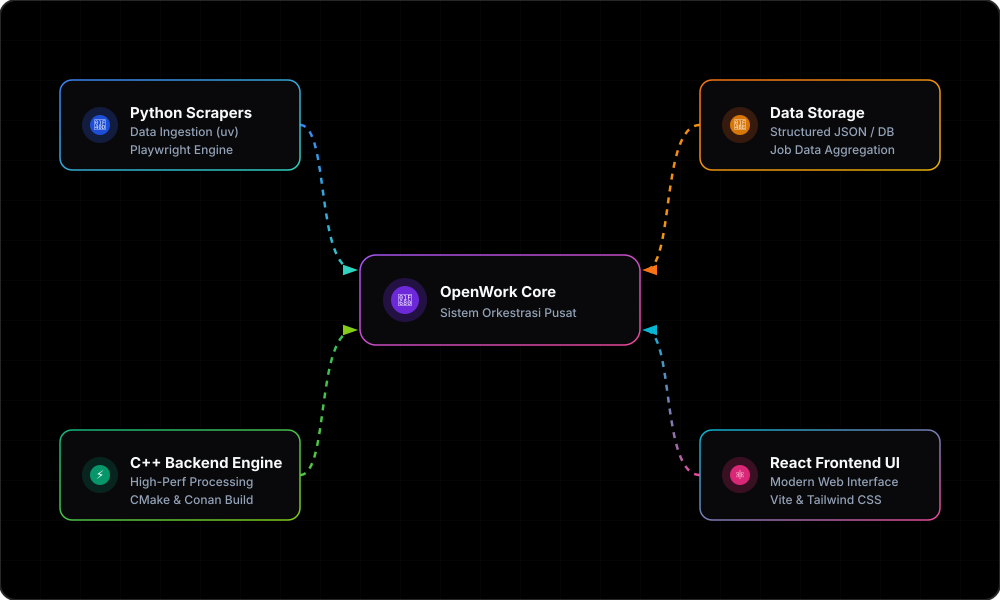

<div align="center">
  
</div>

<br>
<br>

<p align="center">
  <a href="https://skillicons.dev">
    
  </a>
</p>

<br>

<h1 align="center">OpenWork: Job Hunter AI Agents dengan Otomasi Scraper Web</h1>

<p align="center">
Sebuah platform asisten pencari kerja cerdas terintegrasi (<b>Job Aggregator dan AI Orchestrator</b>) yang dibangun menggunakan <b>C++</b> sebagai Core Engine dan API Server, <b>Python</b> untuk Otomasi Web Scraping dan AI Agents (Qwen-2.5-72B), serta <b>React.js</b> untuk frontend yang modern dan dinamis.
</p>

<p align="center">
Sistem ini mengotomatiskan scraping dari <b>3 situs lowongan kerja terpopuler</b> (Jobstreet, KitaLulus, dan Loker.id). Asisten AI pintar bertugas mencocokkan kualifikasi profil/CV pengguna dengan lowongan kerja. <b>Admin</b> memiliki kontrol penuh untuk melakukan CRUD lowongan kerja serta memblokir user yang melanggar ketentuan. <b>User</b> dapat mencari dan melamar pekerjaan baik dari lowongan khusus Admin maupun data scraping <i>realtime</i>, lengkap dengan fitur <b>Auto-Bookmark otomatis</b> berbasis AI jika profil pengguna dinilai sangat cocok dengan hasil scraping terbaru.
</p>

---

<div align="center">

### 👥 Kelompok 6 - TRIO R

**Mata Kuliah:** Algoritma dan Pemrograman Lanjut

| Nama Anggota              |     NIM      |
| :------------------------ | :----------: |
| **Rendy**                 | `2509106069` |
| **Muhammad Ihsan Rosadi** | `2509106081` |
| **Rega Wahyu Firenza**    | `2509106085` |

</div>

<br>

<p align="center">
• <a href="#fitur">Fitur</a> • <a href="#technologies">Technologies</a> • <a href="#requirements-dan-setup">Requirements dan Setup</a>
</p>

---

## ✨ Fitur Utama

- 🔍 **Otomasi Web Scraping (3 Platform)** - Pengambilan data lowongan secara otomatis dan berkala dari **Jobstreet**, **KitaLulus**, dan **Loker.id** menggunakan Python browser automation terpusat.
- 🤖 **AI Agents Orchestrator (Qwen-2.5-72B)** - Didukung oleh asisten AI pintar terintegrasi OpenRouter:
  - **Profile Matching**: Menganalisis kecocokan kualifikasi profil/CV pengguna dengan kriteria pekerjaan.
  - **Auto-Bookmark**: Secara otomatis menyaring lowongan hasil scraping terbaru dan menyimpannya jika tingkat kecocokan dinilai tinggi oleh AI.
  - **AI Career Consultant**: Fitur interaktif untuk berdiskusi karir dan menganalisis detail lowongan kerja.
- 🚨 **Core Engine dan API Server C++** - Engine backend performa tinggi yang mengelola autentikasi pengguna, penyimpanan terstruktur berbasis JSON, serta pembagian peran:
  - **Fitur Admin**: Mengelola data lowongan (CRUD lowongan admin) serta mengaudit dan memblokir/membuka blokir akses user.
  - **Fitur User**: Menjelajah lowongan, melamar pekerjaan dari postingan admin maupun data _realtime_ hasil scraping, serta mengelola bookmark.
- 🎨 **Dashboard Web Modern React.js** - Antarmuka pengguna interaktif dan dinamis berbasis React dan Tailwind CSS untuk visualisasi hasil scraping, statistik pencarian, dan manajemen bookmark secara langsung.

## ⚙️ Algoritma Sort & Search

Untuk memproses dan mengelola data lowongan secara mandiri dan cepat, proyek ini menerapkan algoritma pencarian (_searching_) dan pengurutan (_sorting_) di dalam berkas [utils.hpp](include/utils.hpp):

- **Bubble Sort (Gaji):** Mengurutkan lowongan berdasarkan ekspektasi gaji tertinggi secara menurun (_descending_) dengan optimasi bendera _swapped_ untuk mempercepat proses.
- **Bubble Sort Indeks (ID):** Mengurutkan nomor indeks bantu secara menaik (_ascending_) berdasarkan ID lowongan sebagai persiapan untuk pencarian biner tanpa merusak urutan data asli.
- **Linear Search (Judul):** Mencari kata kunci judul lowongan kerja secara berurutan dengan optimasi _Transpose_ (memindahkan lowongan yang ditemukan ke indeks pertama agar pencarian berikutnya untuk judul yang sama menjadi instan).
- **Binary Search (ID):** Melakukan pencarian biner dengan kecepatan tinggi $O(\log n)$ untuk menemukan detail lowongan kerja berdasarkan ID menggunakan pemetaan array indeks terurut.

## 🔌 Technologies Used

| Teknologi                                                                  | Deskripsi                                      |
| -------------------------------------------------------------------------- | ---------------------------------------------- |
| [C++](https://isocpp.org/)<br>[CMake](https://cmake.org/)                  | Core engine backend dan build system           |
| [Conan](https://conan.io/)                                                 | Package manager untuk manajemen dependensi C++ |
| [Python](https://www.python.org/)<br>[uv](https://github.com/astral-sh/uv) | Script scraping dan dependency manager Python  |
| [React.js](https://reactjs.org/)                                           | Library JavaScript untuk UI frontend           |
| [Tailwind CSS](https://tailwindcss.com/)                                   | Framework CSS untuk styling yang fleksibel     |
| [Vite](https://vitejs.dev/)                                                | Build tool dan dev server frontend super cepat |

## 📂 Struktur Direktori Proyek

<details>
<summary><b>Klik untuk melihat struktur lengkap folder proyek</b></summary>
<br>

```text
├── data
│   ├── lowongan.json
│   ├── profile.json
│   └── users.json
├── frontend
│   ├── public
│   │   ├── diagram.svg
│   │   ├── favicon.svg
│   │   └── icons.svg
│   ├── src
│   │   ├── assets
│   │   │   ├── hero.png
│   │   │   ├── react.svg
│   │   │   └── vite.svg
│   │   ├── components
│   │   │   ├── FilterBar.jsx
│   │   │   ├── Header.jsx
│   │   │   ├── JobDetail.jsx
│   │   │   ├── JobRow.jsx
│   │   │   ├── JobTable.jsx
│   │   │   ├── Pagination.jsx
│   │   │   ├── SearchBar.jsx
│   │   │   ├── StatsBar.jsx
│   │   │   └── Toast.jsx
│   │   ├── hooks
│   │   │   └── useJobs.js
│   │   ├── App.jsx
│   │   ├── index.css
│   │   └── main.jsx
│   ├── .gitignore
│   ├── bun.lock
│   ├── eslint.config.js
│   ├── index.html
│   ├── package.json
│   ├── postcss.config.js
│   ├── tailwind.config.js
│   └── vite.config.js
├── include
│   ├── api
│   │   └── api_server.hpp
│   ├── bridge
│   │   └── python_bridge.hpp
│   ├── core
│   │   └── json_storage.hpp
│   ├── services
│   │   ├── auth_service.hpp
│   │   ├── job_service.hpp
│   │   └── profile_service.hpp
│   ├── constants.hpp
│   ├── models.hpp
│   ├── utils.hpp
│   └── validation.hpp
├── scripts
│   ├── agents
│   │   ├── __init__.py
│   │   ├── analyst.py
│   │   ├── auto_matcher.py
│   │   ├── client.py
│   │   └── matcher.py
│   ├── scrapers
│   │   ├── __init__.py
│   │   ├── jobstreet_scraper.py
│   │   ├── kitalulus_scraper.py
│   │   ├── lokerid_scraper.py
│   │   ├── scraper_manager.py
│   │   └── utils.py
│   ├── shared
│   │   ├── __init__.py
│   │   ├── bridge.py
│   │   └── skema.py
│   ├── .gitignore
│   ├── main.py
│   ├── pyproject.toml
│   └── uv.lock
├── src
│   ├── api
│   │   └── api_server.cpp
│   ├── bridge
│   │   └── python_bridge.cpp
│   ├── core
│   │   └── json_storage.cpp
│   ├── services
│   │   ├── auth_service.cpp
│   │   ├── job_service.cpp
│   │   └── profile_service.cpp
│   └── main.cpp
├── .gitignore
├── CMakeLists.txt
├── LICENSE
├── README.md
└── conanfile.txt
```
</details>

<br>

## ⚙️ Requirements dan Setup

Berikut adalah panduan langkah demi langkah untuk melakukan setup proyek dari nol (Zero to Hero).

### 1. Setup Backend C++ (CMake dan Conan)

Pastikan Anda telah menginstal compiler C++ (seperti GCC, Clang, atau MSVC/Visual Studio Build Tools di Windows).

1. **Download & Install CMake:**
   - Kunjungi [cmake.org/download](https://cmake.org/download/).
   - Unduh installer sesuai OS Anda (misal: `Windows x64 Installer`).
   - Saat instalasi, **pastikan mencentang opsi "Add CMake to the system PATH for all users"** agar bisa dijalankan dari terminal.
   - Verifikasi instalasi di terminal dengan: `cmake --version`

2. **Download & Install Conan (C++ Package Manager):**
   - Conan diinstal menggunakan Python (pip). Pastikan Python sudah terinstal di sistem Anda.
   - Buka terminal dan jalankan:
     ```bash
     pip install conan
     ```
   - Buat default profile (hanya perlu dijalankan sekali):
     ```bash
     conan profile detect
     ```

3. **Install VS Code Extension (Sangat Direkomendasikan):**
   - Cari dan instal ekstensi **CMake Tools** oleh Microsoft (`ms-vscode.cmake-tools`) di VS Code Anda.
   - Ekstensi ini otomatis mendeteksi konfigurasi `CMakeLists.txt`, melakukan _syntax highlighting_, dan mempermudah proses kompilasi. Anda cukup menekan tombol ⚙️ **Build** di _status bar_ bawah VS Code tanpa perlu mengetik perintah manual di terminal setiap kali mengubah kode.

4. **Build Proyek C++ (Manual via Terminal):**
   - Di terminal proyek utama Anda, jalankan perintah conan berikut untuk mendownload dependensi dalam mode Debug:
     ```powershell
     conan install . --output-folder=build --build=missing -s build_type=Debug
     ```
   - Masuk ke folder build:
     ```powershell
     cd build
     ```
   - Lakukan konfigurasi CMake menggunakan compiler MinGW dan toolchain yang dihasilkan oleh Conan:
     ```powershell
     cmake .. -G "MinGW Makefiles" `
         -DCMAKE_TOOLCHAIN_FILE="conan_toolchain.cmake" `
         -DCMAKE_BUILD_TYPE=Debug `
         -DCMAKE_MAKE_PROGRAM="C:/ProgramData/mingw64/mingw64/bin/mingw32-make.exe"
     ```
   - Jalankan kompilasi proyek:
     ```powershell
     cmake --build .
     ```

### 2. Setup Python dan uv (Untuk Web Scraper)

Proyek ini menggunakan `uv`, package manager Python yang sangat cepat.

1. **Download & Install uv:**
   - **Windows:** Buka PowerShell dan jalankan:
     ```powershell
     powershell -ExecutionPolicy ByPass -c "irm https://astral.sh/uv/install.ps1 | iex"
     ```
   - **macOS/Linux:** Jalankan di terminal:
     ```bash
     curl -LsSf https://astral.sh/uv/install.sh | sh
     ```
   - Verifikasi instalasi dengan: `uv --version`

2. **Setup Environment and Dependencies:**
   - Di root folder proyek, buat virtual environment dan sinkronisasi dependensi:
     ```bash
     uv venv
     uv sync
     ```
   - _Opsional: menggunakan Playwright, install browser pendukungnya:_
     ```bash
     uv run playwright install chromium
     ```

3. **Menjalankan Script Scraper:**
   ```bash
   uv run scripts/main.py
   ```

### 3. Setup Frontend React

1. **Download & Install Node.js:**
   - Kunjungi situs resmi [nodejs.org](https://nodejs.org/).
   - Unduh versi **LTS (Long Term Support)** yang direkomendasikan.
   - Jalankan installer dan ikuti petunjuk (Next terus). `npm` (Node Package Manager) akan otomatis terinstal bersama Node.js.
   - Verifikasi instalasi di terminal:
     ```bash
     node --version
     npm --version
     ```

2. **Menjalankan Frontend React:**
   - Pindah ke folder frontend:
     ```bash
     cd frontend
     ```
   - Install seluruh dependensi (React, Vite, Tailwind, dll):
     ```bash
     npm install
     ```
   - Jalankan server development:
     ```bash
     npm run dev
     ```
   - Buka browser Anda di `http://localhost:5173` (atau sesuai port yang tampil di terminal).

### 4. Setup API Key OpenRouter (.env)

AI Agents di platform **OpenWork** menggunakan model **Qwen-2.5-72b-instruct** yang diakses melalui layanan API **OpenRouter**. Ikuti langkah-langkah di bawah ini untuk mengonfigurasinya:

1. **Dapatkan API Key OpenRouter:**
   - Kunjungi situs resmi [OpenRouter.ai](https://openrouter.ai/).
   - Lakukan pendaftaran (**Sign Up**) atau masuk (**Sign In**).
   - Setelah masuk, buka halaman **Keys** di [openrouter.ai/keys](https://openrouter.ai/keys).
   - Klik tombol **Create Key** (Buat Kunci), beri nama kunci tersebut (misalnya: `OpenWork-Dev`), lalu klik **Create**.
   - Salin kunci API yang dihasilkan (biasanya dimulai dengan `sk-or-v1-...`). Simpan baik-baik karena kunci ini hanya ditampilkan sekali!
   
2. **Buat file `.env` secara langsung:**
   - Di root folder proyek **Agents-boilerplate**, buat berkas baru bernama `.env`.
   - Buka berkas `.env` tersebut menggunakan VS Code atau teks editor pilihan Anda.
   - Masukkan baris konfigurasi berikut dan isi dengan API Key yang telah Anda salin sebelumnya:
     ```env
     # API Key dari OpenRouter (Qwen-2.5-72b-instruct)
     OPENROUTER_API_KEY=sk-or-v1-isi_api_key_anda_disini
     ```
   - Simpan berkas tersebut.

> [!WARNING]
> File `.env` berisi kredensial sensitif Anda dan secara default sudah terdaftar di berkas `.gitignore` agar tidak terunggah ke repositori Git publik. Jangan pernah membagikan berkas `.env` atau menghapusnya dari daftar gitignore.

3. **Verifikasi AI Agent:**
   - Untuk memverifikasi apakah integrasi berjalan lancar, pastikan Anda telah melakukan langkah setup Python, kemudian jalankan:
     ```bash
     uv run scripts/main.py
     ```
   - Pilih opsi yang berinteraksi dengan AI Agent (misalnya Analyst Agent atau Match Profile). Jika berhasil mengirim dan menerima respons tanpa error, konfigurasi Anda sudah selesai!

<br>

